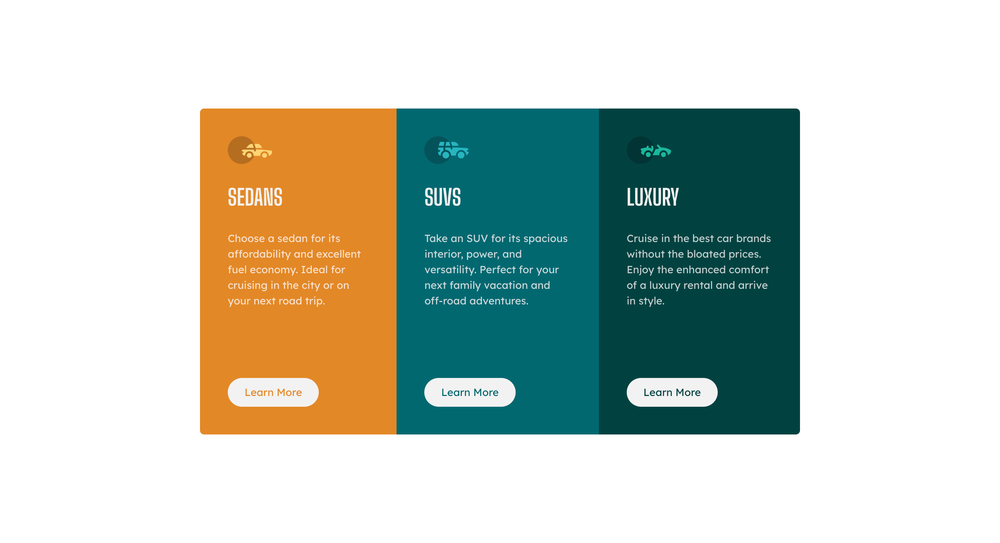

# Frontend Mentor - 3-column preview card component solution

This is a solution to the [3-column preview card component challenge on Frontend Mentor](https://www.frontendmentor.io/challenges/3column-preview-card-component-pH92eAR2-). Frontend Mentor challenges help practice and improve coding skills by building realistic projects.

## Table of contents

- [Overview](#overview)
  - [The challenge](#the-challenge)
  - [Screenshot](#screenshot)
  - [Links](#links)
- [My process](#my-process)
  - [Built with](#built-with)
- [Author](#author)

## Overview

### The challenge

The challenge is to build out this 3-column preview card component and get it looking as close to the design as possible.
This challenge focuses mostly on HTML & CSS.

Your users should be able to:

- View the optimal layout for the interface depending on their device's screen size
- See hover and focus states for all interactive elements

### Screenshot

#### Desktop

#### Mobile

### Links

- Live Site URL: (https://danclubb-frontend-mentor-challenges.vercel.app/3-column-preview-card)

## My process

### Built with

- [Next.js](https://nextjs.org/) - React framework
- CSS

## Author

- Website - [Dan Clubb](https://danclubb.vercel.app/)
- All my Frontend Mentor Solutions - https://danclubb-frontend-mentor-challenges.vercel.app/
