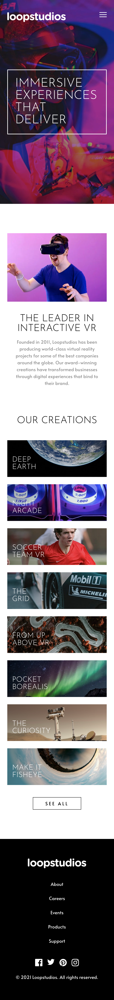

# Frontend Mentor - Loopstudios Landing Page solution

This is a solution to the [Loopstudios Landing Page challenge on Frontend Mentor](https://www.frontendmentor.io/challenges/loopstudios-landing-page-N88J5Onjw). Frontend Mentor challenges help practice and improve coding skills by building realistic projects.

## Table of contents

- [Overview](#overview)
  - [The challenge](#the-challenge)
  - [Screenshot](#screenshot)
  - [Links](#links)
- [My process](#my-process)
  - [Built with](#built-with)
- [Author](#author)

## Overview

### The challenge

This challenge is to build out the landing page and get it looking as close to the design as possible.
This challenge focuses mostly on HTML & CSS. There's a tiny bit of JS included for the mobile navigation toggle.

Users should be able to:

- View the optimal layout for the site depending on their device's screen size
- See hover states for all interactive elements on the page

### Screenshot

#### Desktop

#### Mobile

### Links

- Live Site URL: (https://danclubb-frontend-mentor-challenges.vercel.app/loopstudios-landing-page)

## My process

### Built with

- [Next.js](https://nextjs.org/) - React framework
- CSS
- Mobile-first workflow

## Author

- Website - [Dan Clubb](https://danclubb.vercel.app/)
- All my Frontend Mentor Solutions - https://danclubb-frontend-mentor-challenges.vercel.app/
